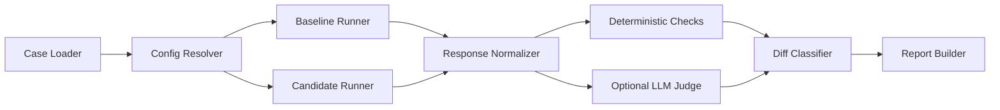

# RunDiff Architecture Overview

Visibility: Public

Date: 2026-04-14

## Objective

RunDiff should compare baseline and candidate AI configurations in a way that is reproducible, inspectable, and useful for rollout decisions.

## High-Level Flow

## Logical Components

### Case Loader

Loads the canonical case schema from JSONL or another future supported source.

### Config Resolver

Builds runnable baseline and candidate configurations from local config files and environment variables.

### Provider Adapters

Own thin integrations with the first supported LLM endpoints.

### Baseline And Candidate Runner

Execute the same cases under both configurations with consistent runtime controls.

### Response Normalizer

Converts provider-specific responses into a stable internal comparison representation.

### Deterministic Checks

Evaluate schema validity, parseability, exact or rule-based expectations, and other non-judgmental checks.

### Optional LLM Judge

Adds semantic scoring or classification where deterministic checks are insufficient.

### Diff Classifier

Groups differences into a small number of rollout-relevant categories.

### Report Builder

Produces JSON and human-readable artifacts.

## Design Principles

- baseline-versus-candidate first
- representative workloads over generic benchmark obsession
- deterministic checks first, judge second
- provider adapters should stay thin
- reports should be reviewer-friendly and artifact-oriented
- the project should stay Python-native and CLI-first at v0.1

## Likely Deployment Modes

Planned in order:

1. local Python CLI
2. library API
3. CI job or reusable gate command
4. later lightweight service mode only if justified

## Main Risks

- over-broad provider abstraction too early
- unclear case schema
- overreliance on LLM judging where deterministic checks would suffice
- drifting into a broad experiment platform instead of a narrow rollout gate
- weak report artifacts that do not support real decisions

## Decisions Needed Before Coding

- canonical case schema
- first provider set
- first report formats
- judge policy and failure behavior
- initial deterministic check set
