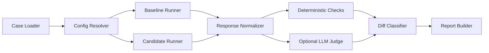

# RunDiff Architecture Overview

Visibility: Public

Date: 2026-04-14

## Objective

RunDiff should compare baseline and candidate AI configurations in a way that is reproducible, inspectable, and useful for rollout decisions.

The architecture should answer one narrow question well:

`What changed between baseline and candidate, and is the change safe to ship?`

## Two Different LLM Roles

RunDiff may use LLM endpoints in two distinct ways. These should never be blurred together.

### 1. System-Under-Test LLM

This is the endpoint being evaluated.

Examples:

- the baseline model answering the workload case
- the candidate model answering the same case
- the baseline and candidate producing structured output for the same extraction task

In this role, the LLM is doing the application task itself.

Typical tasks:

- answer generation
- extraction into a schema
- classification
- summarization
- transformation or rewriting

### 2. Judge LLM

This is an optional separate evaluator used only when deterministic checks are not enough.

In this role, the LLM is not solving the product task for an end user. It is helping RunDiff evaluate whether the baseline and candidate differ in a rollout-significant way.

Typical tasks:

- pairwise preference between baseline and candidate
- rubric-based scoring of quality dimensions
- classification of semantic regressions
- extraction of a structured judgment record

The judge must be clearly separated in configuration, output, and reporting from the system-under-test results.

## High-Level Flow

## Component Overview

### Case Loader

Purpose:

- load the canonical case schema from JSONL or another future supported source

Responsibilities:

- parse workload cases into a stable internal structure
- validate required fields before execution starts
- attach case-level metadata needed by later stages

Likely case fields:

- `case_id`
- task input such as prompt, messages, or document text
- optional expected structured output or reference answer
- deterministic check configuration
- optional judge rubric or evaluation hints
- tags such as feature, customer segment, or scenario type

Why it matters:

- the case schema defines what RunDiff can compare
- weak case structure will make every downstream component fuzzy

Relation to LLM usage:

- the case defines the task the baseline and candidate LLMs are asked to perform
- it may also define what semantic question the judge LLM should answer later

### Config Resolver

Purpose:

- build runnable baseline, candidate, and optional judge configurations from local files and environment variables

Responsibilities:

- resolve provider, model, API base, and auth details
- resolve prompt or system-message differences
- resolve runtime controls such as temperature, max tokens, and retries
- keep baseline and candidate execution settings explicit
- keep judge configuration separate from the evaluated configs

Why it matters:

- hidden config differences make comparisons untrustworthy
- the report should always be able to say exactly what was compared

Relation to LLM usage:

- this is where RunDiff defines which endpoint is the system under test
- if judging is enabled, this is also where it defines which endpoint is the meta-evaluator

### Provider Adapters

Purpose:

- own thin integrations with the first supported LLM endpoints

Responsibilities:

- convert RunDiff’s internal request shape into provider-specific API calls
- capture provider-specific response metadata
- normalize error handling at the adapter boundary
- keep each integration narrow and testable

Typical adapter inputs:

- messages or prompt payload
- model name
- inference parameters
- response format or schema hints where supported

Typical adapter outputs:

- raw model output
- structured-output payload if present
- usage metadata such as token counts
- latency and provider response metadata
- error or refusal details

Why it matters:

- provider SDKs differ, but RunDiff needs one stable execution contract
- provider adapters should not contain evaluation logic

Relation to LLM usage:

- this is the layer that actually calls the baseline and candidate LLM endpoints
- a separate adapter path may also call the judge endpoint if configured

### Baseline And Candidate Runner

Purpose:

- execute the same cases under both configurations with consistent runtime controls

Responsibilities:

- run each case against baseline and candidate
- preserve case ordering and reproducibility metadata
- capture failures without collapsing the whole run
- record enough information to support later debugging

Important controls:

- retry policy
- timeout policy
- concurrency limits
- seeding or deterministic settings where the provider supports them
- consistent prompt assembly rules

Why it matters:

- the runner defines whether the comparison is fair
- if baseline and candidate are executed differently in hidden ways, the output is not trustworthy

Relation to LLM usage:

- this is where the application task is performed by the system-under-test LLMs
- RunDiff should treat these calls as the primary experiment surface

### Response Normalizer

Purpose:

- convert provider-specific responses into a stable internal comparison representation

Responsibilities:

- extract text output into a canonical field
- extract structured payloads into parseable internal forms
- carry forward usage and latency metadata
- represent errors, refusals, and null outputs explicitly

A likely normalized record includes:

- `case_id`
- baseline result
- candidate result
- normalized text content
- normalized structured content
- runtime metadata
- provider/model metadata
- execution status

Why it matters:

- the rest of the system should not care whether the underlying provider was OpenAI, Anthropic, or another compatible endpoint
- normalization creates a shared surface for checks, judging, and reports

Relation to LLM usage:

- this component does not call an LLM
- it prepares the output of prior LLM calls so later components can evaluate them consistently

### Deterministic Checks

Purpose:

- evaluate non-judgmental expectations first

Responsibilities:

- validate schema conformance
- confirm parseability of structured output
- run exact-match or rule-based assertions where appropriate
- compute deterministic regressions before semantic judging

Examples:

- candidate JSON does not parse
- candidate violates the declared schema
- baseline passes a regex or field-level rule and candidate fails it
- candidate omits a required key

Why it matters:

- many rollout-significant failures do not require another LLM to detect
- deterministic checks are cheaper, more reproducible, and easier to defend in review

Relation to LLM usage:

- this component should not call an LLM
- it is intentionally the first pass so the system does not waste LLM-judge calls on obvious failures

### Optional LLM Judge

Purpose:

- evaluate semantic differences when deterministic checks are insufficient

Responsibilities:

- compare baseline and candidate outputs for the same case
- optionally score outputs against a rubric
- return a structured judgment record
- keep rationale and confidence clearly labeled as judge-derived

Likely judge tasks:

- pairwise preference: which output is better for the task
- semantic regression classification: improved, same, regressed
- rubric scoring: correctness, completeness, faithfulness, tone, or instruction-following
- failure explanation: why a result may need human review

Likely judge inputs:

- case task input
- optional reference answer or rubric
- baseline normalized output
- candidate normalized output
- task-specific instructions for the judge

Likely judge outputs:

- structured label such as `candidate_better`, `baseline_better`, `tie`, or `unclear`
- optional per-dimension scores
- short rationale
- confidence or uncertainty signal if supported by the design

Why it matters:

- many real regressions are semantic rather than structural
- teams still need help deciding whether a different-but-valid answer is acceptable

Relation to LLM usage:

- this is the second place where RunDiff may call an LLM endpoint
- unlike the baseline and candidate runners, this LLM is performing an evaluation task, not the application task

Operational rule:

- judge output must never be mixed into deterministic results as if they were the same kind of evidence

### Diff Classifier

Purpose:

- convert raw checks and optional judge output into rollout-relevant categories

Responsibilities:

- merge deterministic and judge-derived signals
- preserve provenance for each conclusion
- classify each case into a small decision-oriented bucket

Possible buckets:

- `no_change`
- `improved`
- `deterministic_regression`
- `semantic_regression`
- `needs_review`
- `runner_error`

Why it matters:

- raw metrics and raw judge labels are not yet a rollout decision
- engineering teams need a compact interpretation layer

Relation to LLM usage:

- this component should not call an LLM
- it consumes the outputs of deterministic checks and the optional judge and turns them into review-friendly categories

### Report Builder

Purpose:

- produce machine-readable and human-readable artifacts

Responsibilities:

- emit JSON for automation and downstream tooling
- emit Markdown or HTML for human review
- surface the final rollout recommendation
- preserve drill-down paths for per-case inspection

The report should make these distinctions explicit:

- deterministic failures versus judge-derived concerns
- baseline and candidate config details
- case-level evidence
- skipped or failed judge calls

Why it matters:

- the report is the main product artifact
- if the report is weak, the rest of the architecture does not create user value

Relation to LLM usage:

- this component does not call an LLM
- it explains where LLM-derived judgments influenced the report and where they did not

## Internal Data Contracts

The first implementation does not need a complex service boundary, but it does need stable internal records.

Recommended internal record types:

- `Case`: the workload unit to execute
- `RunConfig`: baseline, candidate, or judge configuration
- `RunResult`: one model run over one case
- `CheckResult`: one deterministic validation result
- `JudgeResult`: one semantic evaluation result
- `DiffRecord`: merged per-case conclusion
- `Report`: final summary plus detailed case records

These records should make provenance obvious.

Example:

- which output came from the baseline runner
- which conclusion came from a deterministic check
- which label came from the judge

## Design Principles

- baseline-versus-candidate first
- representative workloads over generic benchmark obsession
- deterministic checks first, judge second
- provider adapters should stay thin
- reports should be reviewer-friendly and artifact-oriented
- the project should stay Python-native and CLI-first at v0.1
- the system-under-test LLM and judge LLM must stay conceptually separate

## Likely Deployment Modes

Planned in order:

1. local Python CLI
2. library API
3. CI job or reusable gate command
4. later lightweight service mode only if justified

## Main Risks

- over-broad provider abstraction too early
- unclear case schema
- overreliance on LLM judging where deterministic checks would suffice
- muddy separation between evaluated outputs and judge outputs
- drifting into a broad experiment platform instead of a narrow rollout gate
- weak report artifacts that do not support real decisions

## Decisions Needed Before Coding

- canonical case schema
- first provider set
- first report formats
- judge policy and failure behavior
- initial deterministic check set
- first judge task shape, such as pairwise preference versus rubric scoring
